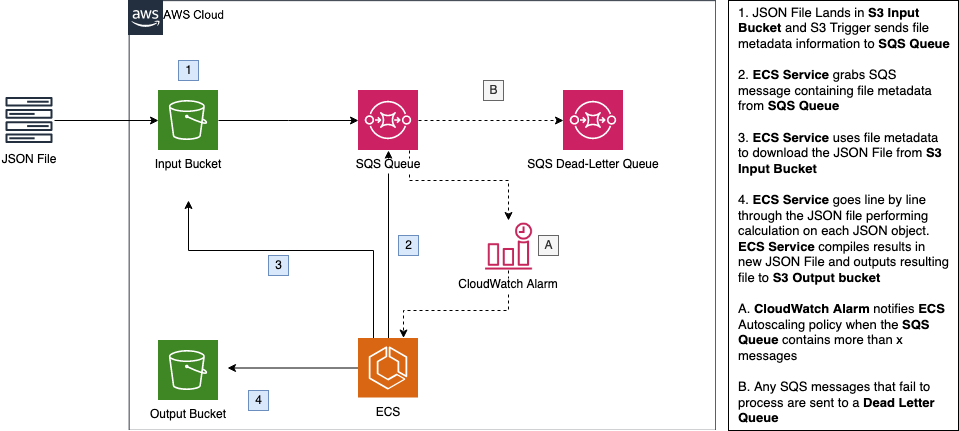

# ecs-batch-design-pattern

## ECS Batch Processor

Perform an automatic long-running batch process on a line-delimited JSON file
that is uploaded to Amazon S3.

----

## Table Of Contents

1. [Use Case](readme.md#use-case)
2. [About](readme.md#about)
3. [Architecture](readme.md#architecture)
4. [Repository Contents](readme.md#repo-contents)
5. [Set Up](readme.md#set-up)
6. [Deployment](readme.md#deployment)

----

## use-case

JSON File batch processing use cases that require **more than 900 seconds** (the
AWS Lambda limit)

----

## about

This repository contains sample infrastructure-as-code and a tutorial for how to
get started using Amazon ECS as a batch processing tool.

This repo has two options for deploying ECS. These launch types (EC2 + Fargate)
can define how the compute resources will be managed. The traditional EC2 launch
type detailed in the overview above utilizes your own EC2 instances. Fargate
removes the responsibility of provisioning, configuring and managing the EC2
instances by allowing AWS to manage the EC2 instances.

The CloudFormation templates create an input and an output Amazon S3
bucket, an Amazon SQS queue, an Amazon CloudWatch alarm, an ECS cluster, and
an ECS task definition.

Objects uploaded to the input S3 bucket trigger an event that sends object
details to the SQS queue. The ECS task deploys a Docker container that reads
from that queue, parses the message containing the object name and then
downloads the object. The ECS task will perform calculations on each line of the
file. Once transformed it will upload the objects to the S3 output bucket.

Since this solution uses Amazon Elastic Container Service, you'll need to set up
Docker running on your local machine. Docker will allow you to push code to the
Amazon Elastic Container Registry, which will hold a "packaged" container for
Amazon Elastic Container Service to reference when deploying containers.

----

## architecture

----

## repo-contents

### 1. docker/Dockerfile

A list of commands to run that sets up a Docker Container.  Sets up aws boto3
and executes process_message.py script.

        FROM ubuntu:18.04

        RUN apt-get update
        RUN apt-get install -y python-pip
        RUN pip install awscli boto3
        RUN pip install requests

        ADD process_message.py /

        CMD ["/process_message.py"]

### 2. docker/process_message.py

A Python Script located on an AWS ECS container.

#### What it does

1. ECS Service grabs SQS message containing file metadata from SQS Queue
2. ECS Service uses file metadata to download the JSON lines file from S3 Input
   Bucket
3. ECS Service goes line by line through the JSON file and performs calculation
   on each json object
4. ECS Service compiles results in new JSON File and outputs resulting file to
   S3 Output bucket

within **docker/process_message.py** exists a calculation function. This is
where you'd perform a custom calculation on a json object.

        def calculation(json_obj):
            """
            PERFORM YOUR CUSTOM CODE / CALCULATION ON THE JSON OBJECT HERE

            returns json object
            """

            new_obj = {} # PLACEHOLDER

            return new_obj

### 3. sample_data/yelp_businesses.json

Here is a snippet from that json file:

        {"business_id": "f9NumwFMBDn751xgFiRbNA", "name": "The Range At Lake Norman", "address": "10913 Bailey Rd", "city": "Cornelius", "state": "NC", "postal_code": "28031", "latitude": 35.4627242, "longitude": -80.8526119, "stars": 3.5, "review_count": 36, "is_open": 1, "categories": "Active Life, Gun/Rifle Ranges, Guns & Ammo, Shopping"}
        {"business_id": "Yzvjg0SayhoZgCljUJRF9Q", "name": "Carlos Santo, NMD", "address": "8880 E Via Linda, Ste 107", "city": "Scottsdale", "state": "AZ", "postal_code": "85258", "latitude": 33.5694041, "longitude": -111.8902637, "stars": 5.0, "review_count": 4, "is_open": 1, "categories": "Health & Medical, Fitness & Instruction, Yoga, Active Life, Pilates"}

As you can see, there exists a json object on each line. This is what
**docker/process_message.py** can perform calculations on.  In this sample, you
could perform a calculation that takes json_obj['stars'] and multiplies it by
json_obj['review_count'] to create a new score that benefits yelp businesses
with many reviews.

Your **docker/process_message.py** script would look something like this:

        def calculation(json_obj):
            """
            create a review_score and append to the json obj

            returns json object
            """

            stars = float(json_obj['stars'])

            reviews = float(json_obj['review_count])

            json_obj['review_score'] = stars * reviews

            return json_obj

This calculation would occur for every line in the line-delimited json file.

### 4. templates/ecs-ec2.yaml

The following sections explain all of the resources created by the
CloudFormation template provided with this example.

- **rS3InputBucket** - An S3 bucket where objects are input to start the batch
process.

- **rS3OutputBucket** - An S3 bucket where output files are uploaded

- **rSQSQueue** - A SQS queue that holds messages containing the name of the
uploaded object.

- **rSQSDeadLetterQueue** - A SQS dead letter queue for messages that was
unsuccessfully handled.

- **rECSCluster** - An ECS cluster.

- **rSQSCloudWatchAlarm** - A CloudWatch Alarm for the SQS queue for the
ApproximateNumberOfMessagesVisible metric.

- **rScaleUpPolicy** - Auto Scaling scaling policy so that the Auto Scaling
group can increases the number of instances available for your application in
response to changing demand

- **rScaleDownPolicy** - Auto Scaling scaling policy so that the Auto Scaling
group can decreases the number of instances available for your application in
response to changing demand

- **rECSAutoScalingGroup** - An Auto Scaling group used to create your
instances.

- **rInstanceSecurityGroup** - Security Group to which your instances are added.

- **rTaskDefinition** - An ECS EC2 task definition that is started by the ECS
service. The ECS task schedules a Docker container that copies the uploaded
object and performs a calculation via API on each line of the JSON file and then
outputs the results in the output S3 bucket.

- **rECSService** - Amazon ECS service enables you to run and maintain a
specified number of instances of a task definition simultaneously in an Amazon
ECS cluster. If any of your tasks should fail or stop for any reason, the Amazon
ECS service scheduler launches another instance of your task definition to
replace it in order to maintain the desired number of tasks in the service.

- **rECSServiceRole** -  An IAM role assumed by the ECS service, which gives the
service the right to register instances to an Elastic Load Balancer if needed.

- **rEC2Role** - An IAM role assumed by the EC2 instances, which gives them the
right to register themselves with the ECS services.

- **rECSTaskRole** - An IAM role assumed by the ECS task. This role gives the
Docker container the right to upload and fetch objects to and from S3 as well as
read and delete messages from the SQS queue. By using an ECS task role, the
underlying EC2 instances do not need to be given access rights to the resources
that the container uses. For more information about IAM roles for tasks, see
[IAM Roles for Tasks](http://docs.aws.amazon.com/AmazonECS/latest/developerguide/
task-iam-roles.html).

### 5. templates/ecs-fargate.yaml

The following sections explain all of the resources created by the
CloudFormation template provided with this example.

- **rSQSQueue** - A SQS queue that holds messages containing the name of the
uploaded object.

- **rSQSDeadLetterQueue** - A SQS dead letter queue for messages that was
unsuccessfully handled.

- **rSQSBatchQueuePolicy** - Allows S3 to send messages to the SQS Queue.

- **rS3InputBucket** - An S3 bucket where objects are input to start the batch
process.

- **rS3OutputBucket** - An S3 bucket where output files are uploaded

- **rECSCluster** - An ECS cluster.

- **rTaskDefinition** - An ECS FARGATE task definition that is started by the ECS
service. The ECS task schedules a Docker container that copies the uploaded
object and performs a calculation via API on each line of the JSON file and then
outputs the results in the output S3 bucket.

- **rExecutionRole** -   An IAM role assumed by the ECS service that allows it
to execute tasks

- **rECSTaskRole** - An IAM role assumed by the ECS task. This role gives the
Docker container the right to upload and fetch objects to and from S3 as well as
read and delete messages from the SQS queue. By using an ECS task role, the
underlying EC2 instances do not need to be given access rights to the resources
that the container uses. For more information about IAM roles for tasks, see
[IAM Roles for Tasks](http://docs.aws.amazon.com/AmazonECS/latest/developerguide/
task-iam-roles.html).

- **rAutoScalingRole** - Allows ECS to auto scale tasks

- **rECSService** Amazon ECS service enables you to run and maintain a
specified number of instances of a task definition simultaneously in an Amazon
ECS cluster. If any of your tasks should fail or stop for any reason, the Amazon
ECS service scheduler launches another instance of your task definition to
replace it in order to maintain the desired number of tasks in the service.

- **rAutoScalingPolicy** -  Auto Scaling scaling policy so that the Auto Scaling
group can decreases the number of ECS tasks available for your application in
response to changing demand

- **rAutoScalingTarget** -  The desired range of ECS tasks to meet demand

- **rLogGroup** - A cloudwatch log group for ECS Fargate to write logs to.

----

## set-up

### 1. Clone the git repo locally

`git clone <repo>`

### 2. Install Docker

Follow this URL for directions on installing Docker:

https://docs.docker.com/get-docker/

### 3. Create a Repo in Amazon Elastic Container Registry

a. Set up an Amazon ECR repository by first going to the [Amazon ECR console]()

b. Select **Create Repository**

c. Provide a namespace/repo-name (ex. ecs-design-pattern/batch-processor )

d. Select **Create Repository**

e. Make a note of the URI next to your repository name.

### 4. Push Container code to Amazon ECR

a. Ensure that Docker is running locally.

b. In a terminal session, navigate to the docker sub-folder in this
repository.

c. Get your Amazon ECR login command and copy the output:

`aws ecr get-login --region us-east-1`

d. Paste the command into your terminal window (remove -e none)

Example:

`docker login -u AWS -p < long-hashed-string > https://012345678901.dkr.ecr.us-east-1.amazonaws.com`

e. Ensure Dockerfile and process_message.py look correct to you.

f. Build the docker image

`docker build -t < insert URI from Step 3e > .`

g. Push the docker image to Amazon ECR repo

`docker push < insert URI from Step 3e >`

----

## deployment

### 1. Deploy the CloudFormation template

a. Go to CloudFormation Console

b. Choose whether you'd like EC2-backed ECS cluster, or an ECS Fargate cluster
(templates/ecs-ec2.yaml or templates/ecs-fargate.yaml)

c. Choose Create Stack and upload your desired cloudformation template.

d. Set the DockerImage parameter to your Amazon ECR repo URI

ex.

012345678910.dkr.ecr.< region-name >.amazonaws.com/< repository-name >:latest

### 2. Trigger the Batch Job

a. Upload sample_data/yelp_businesses.json into your S3 input bucket.

b. Explore the output files in the S3 output bucket.

----
